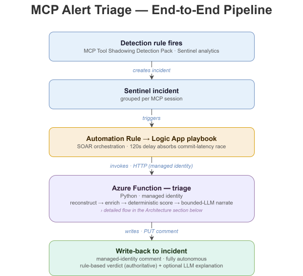
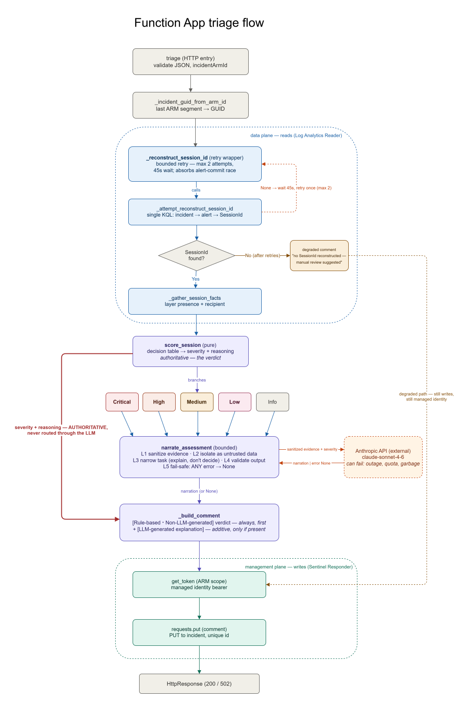

# MCP Alert Triage Automation



Automated investigation and response for Microsoft Sentinel incidents raised by the
[MCP Tool Shadowing Detection Pack](https://github.com/raymondgonsalves/mcp-tool-shadowing-detections).

When a detection fires, this pipeline performs the repetitive first-pass triage a SOC
analyst would otherwise do by hand — reconstruct the session, enrich it, score severity,
and either auto-close with an explanation or escalate with the evidence assembled. A
bounded LLM writes a plain-English incident summary; all decisions are made by
deterministic code, never the model.

> **Status: engineering complete (Sprints 1–4); Sprint 5 is packaging, no new code.**
> A detection incident triggers an automation rule → Logic App playbook → Azure Function
> (managed identity) that reconstructs the SessionId, gathers per-session facts, applies a
> deterministic recipient-aware severity model, has a **bounded LLM narrate** that verdict in
> plain English, and writes the labeled pre-assessment back to the incident — fully
> autonomously, zero human intervention. Both LLM paths are proven against real conditions
> (real narration, and graceful degradation against a real API failure), and a real
> commit-latency race discovered during the first autonomous run was measured and fixed.
> The playbook→Function hop is credential-free (managed identity / Entra). See the
> [documentation map](#documentation) for the build record, the race analysis, and the auth swap.

## The portfolio arc

This is the fifth and final artifact in a connected body of work on agentic-AI security:
**use → defend → analyze → detect → respond.** This project is *respond* — the
operational follow-through to the detection pack.

## Architecture



*The red path — `score_session → _build_comment`, bypassing the LLM entirely — is the
bounded-model guarantee made visual: severity is decided by deterministic code and never
routes through the model.*

```
Detection rule fires → Sentinel incident
  → Automation Rule → Logic App playbook → Azure Function (Python, managed identity)
    → read SessionId (trigger key) → reconstruct session from MCPProtocolLogs_CL
    → deterministic enrichment → deterministic risk scoring
    → sanitize evidence → bounded LLM summary → schema-validate
    → auto-close | escalate | HITL-gated containment → write back to incident
```

The LLM never scores, decides escalation, or contains. That boundary is the core
architectural principle: the model is a bounded component, not the orchestrator. The
guarantee is architectural, not filter-based — severity is decided by `score_session` and
passed to the comment builder directly, never through the LLM's output path. Adversarial
testing confirmed the bound holds: even a fully-compromised model can only produce a
labeled, subordinate explanation beside a correct, authoritative verdict — it cannot change
the severity or trigger an action.

## Documentation

Where to start, depending on what you want to know:

- **How it was built** — [`docs/DAILY_LOG.md`](docs/DAILY_LOG.md), the sprint-by-sprint build record.
- **Does it really work** — [`docs/FINDING_alert_commit_race.md`](docs/FINDING_alert_commit_race.md), the commit-latency race that surfaced on the first autonomous run, how it was measured, and the fix.
- **How the credential-free auth works** — [`docs/GATE2_managed_identity_swap.md`](docs/GATE2_managed_identity_swap.md), the function-key → managed-identity swap.
- **The design** — the [interface contract](docs/INTERFACE_CONTRACT.md) and the architecture diagrams above.
- **The playbook itself** — [`playbooks/pb-mcp-triage-skeleton.definition.json`](playbooks/pb-mcp-triage-skeleton.definition.json), the exported Logic App definition.
- **Evidence** — [`docs/figures/`](docs/figures/), the captured runs and portal states referenced throughout the log.

## Build status by sprint

| Sprint | Scope | Status |
|--------|-------|--------|
| 0 | Detection foundation (four analytics rules live, grouped per session) | Complete |
| 1 | Walking skeleton (automation rule → playbook → Function → managed-identity write-back) | Complete & verified |
| 2 | Deterministic session reconstruction (incident → alert → SessionId, server-side KQL) | Complete & verified |
| 3 | Deterministic recipient-aware scoring (RealizedBreach → Critical) | Complete & verified |
| 4 | Bounded LLM narrator (explains the deterministic verdict; never decides) + commit-latency race fix | Complete & verified |
| 5 | Packaging for publish (docs, figures, exported playbook definition, demo) | In progress |

## Security

**Credential-free playbook→Function auth (Gate 2 — closed 2026-07-15).**
The playbook previously called the Function with a **function key** in the URI (`?code=`),
which would have published the secret if the playbook definition were exported. This was
swapped to **managed-identity auth** (Microsoft Entra / Easy Auth): the playbook presents its
managed identity, the Function validates the token and rejects everything else with 401, and
the old function key was rotated (the previous value now returns 401). Verified by a real
autonomous run (incident #22, key-free). The exported playbook definition in this repo is
therefore key-free by construction; it was secret-scanned before commit. See
[`docs/GATE2_managed_identity_swap.md`](docs/GATE2_managed_identity_swap.md).

**A note on identifiers.**
Resource, tenant, and object identifiers in this repository are redacted-forward to
placeholders as recon-hygiene. Commits prior to the redaction may contain lab
tenant/client/principal IDs in history — **none are credentials.** The pipeline uses
managed-identity authentication with no stored secrets; all such values are Microsoft Entra
object IDs or resource identifiers that grant no access without a separate credential and
RBAC assignment. The lab environment is ephemeral.

## Verifying the pipeline

The auto-written comment renders in the Defender incident **Activities** pane (authored by
the Function's managed identity) and can also be read primary-source via the REST API:

```bash
az rest --method get \
  --url "https://management.azure.com/<incident-arm-id>/comments?api-version=2023-11-01"
```

The comment's `author` will be the Function's managed identity (not a user), which is the
proof of credential-free write-back. Note: the Defender Activity pane's `Trigger` field reads
`Manual` for these comments — this reflects that they are written by an external application
via the ARM comments API, **not** that the Function was manually invoked. Autonomous
invocation is evidenced by the Logic App run history, not that field.
